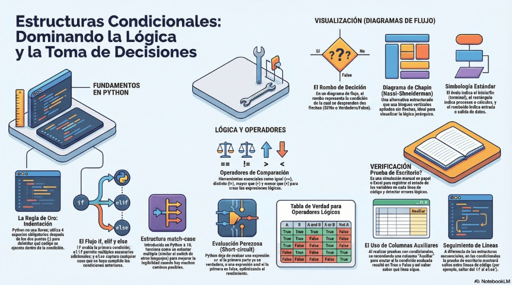

# Unidad 2 - Estructuras Condicionales en Python

**Materia:** Programación 1
**Unidad:** 2 - Estructuras Condicionales
**Tema:** `if`, `elif`, `else`, `match-case`, indentación, precedencia y evaluación booleana

---

## Introducción

En programación, una **estructura condicional** permite ejecutar diferentes bloques de código según si una condición se cumple o no. Es **fundamental para la toma de decisiones** en un programa.

Python usa la palabra clave **`if`** para definir una condición, y opcionalmente se pueden agregar **`else`** y **`elif`** para manejar distintos casos. Por medio de ellas el programa decide qué bloques de código ejecutar primero, o directamente no ejecutarlos.

Para usar bien estas estructuras es necesario entender:

- **Indentación** (cómo Python delimita los bloques).
- **Operadores relacionales** (`==`, `!=`, `<`, `>`, `<=`, `>=`).
- **Operadores lógicos** (`and`, `or`, `not`).



---

## 1. Indentación

A diferencia de lenguajes como **C, Java o Pascal** —que usan llaves `{ }` o palabras clave como `begin` y `end`— **Python usa la indentación** (la sangría o desplazamiento hacia la derecha) para delimitar bloques de código.

Cada vez que una línea termina con **`:` (dos puntos)**, Python espera que el siguiente bloque esté indentado.

### 1.1. Reglas de indentación

| Regla | Detalle |
|-------|---------|
| **Es obligatoria** | Si no se indenta correctamente, Python lanza `IndentationError`. |
| **Consistencia** | Todos los elementos de un bloque deben tener la **misma indentación**. No se pueden mezclar espacios y tabulaciones. |
| **Convención (PEP 8)** | Se recomienda usar **4 espacios** por nivel de indentación. |

### 1.2. Ejemplo

```python
edad = 20

if edad >= 18:
    print("Es mayor de edad")    # ← indentado con 4 espacios
    print("Puede votar")          # ← misma indentación: pertenece al if
print("Fin del programa")         # ← sin indentación: fuera del if
```

### 1.3. Errores frecuentes

```python
# ❌ Mal: falta indentación
if edad >= 18:
print("Hola")              # IndentationError

# ❌ Mal: indentación inconsistente
if edad >= 18:
    print("Hola")
   print("Mundo")          # IndentationError (3 espacios en lugar de 4)

# ✅ Bien
if edad >= 18:
    print("Hola")
    print("Mundo")
```

---

## 2. Estructuras condicionales

### 2.1. `if` simple

Evalúa una condición y, si es **`True`**, ejecuta el bloque de código correspondiente.

```python
edad = 20

if edad >= 18:
    print("Es mayor de edad")
```

### 2.2. `if` con `else`: dos caminos posibles

Cuando necesitamos que se ejecute una acción si la condición es **`False`**, usamos **`else`**.

```python
edad = 15

if edad >= 18:
    print("Es mayor de edad")
else:
    print("Es menor de edad")
```

> Se cumpla o no la condición, el programa siempre notifica al usuario, ya sea por el lado verdadero como por el falso.

### 2.3. `if`, `elif` y `else`: múltiples condiciones

Cuando hay **más de dos** posibles escenarios, usamos **`elif`** (abreviatura de _else if_).

```python
nota = 7

if nota >= 9:
    print("Excelente")
elif nota >= 7:
    print("Aprobado")
elif nota >= 4:
    print("Recuperatorio")
else:
    print("Desaprobado")
```

**Importante:**

- Solo se ejecuta **una sola** condición: la **primera que sea `True`**.
- Si **ninguna** se cumple, Python ejecuta el bloque `else` (si existe).
- Podemos combinar condiciones con **operadores lógicos**.
- Si es necesario, se pueden **anidar** condiciones cuando son expresiones muy complejas y resulta difícil leerlas en una sola línea.

#### Ejemplo con operadores lógicos

```python
edad = 22
tiene_licencia = True

if edad >= 18 and tiene_licencia:
    print("Puede conducir")
elif edad >= 18 and not tiene_licencia:
    print("Es mayor pero no puede conducir")
else:
    print("Es menor de edad")
```

#### Ejemplo con condiciones anidadas

```python
usuario_logueado = True
es_admin = False

if usuario_logueado:
    if es_admin:
        print("Bienvenido administrador")
    else:
        print("Bienvenido usuario")
else:
    print("Por favor, inicie sesión")
```

### 2.4. `match-case`

A partir de **Python 3.10**, podemos usar **`match-case`**, similar al `switch` de otros lenguajes (C, Java). Es más legible cuando hay múltiples caminos posibles.

```python
opcion = "B"

match opcion:
    case "A":
        print("Elegiste la opción A")
    case "B":
        print("Elegiste la opción B")
    case "C":
        print("Elegiste la opción C")
    case _:
        print("Opción no válida")
```

**Explicación:**

- **`match opcion:`** evalúa el valor de `opcion`.
- Cada **`case`** equivale a un `case` en `switch` de otros lenguajes.
- **`_`** (guión bajo) actúa como **default**, cubriendo todas las opciones no listadas.

> 💡 **Cuándo usar `match-case` vs `if/elif/else`:** `match-case` es ideal cuando comparás **un mismo valor** contra varios casos discretos. `if/elif/else` es más flexible cuando las condiciones son **diferentes entre sí** o usan **rangos**.

---

## 3. Expresiones

Una **expresión** en Python puede ser tan simple como un valor literal o una variable, o tan compleja como una combinación de múltiples operadores y funciones.

### 3.1. Expresiones simples

```python
42                  # literal numérico
"hola"              # literal string
True                # literal booleano
edad                # variable
edad + 1            # operación aritmética simple
```

### 3.2. Expresiones compuestas

```python
(edad >= 18) and (tiene_licencia)
nota * 2 + 5
(precio * cantidad) - descuento
not (es_invitado or es_anonimo)
"Hola " + nombre + " " + apellido
```

---

## 4. Precedencia y asociatividad de operadores

Cuando una expresión combina varios operadores, Python sigue un **orden específico** para evaluarlos.

### 4.1. Tabla de precedencia

| Orden | Operadores | Descripción |
|-------|------------|-------------|
| **1** | `()` | Paréntesis (se evalúan **primero**) |
| **2** | `**` | Potencia |
| **3** | `*`, `/`, `//`, `%` | Multiplicación, divisiones y módulo |
| **4** | `+`, `-` | Sumas y restas |
| **5** | `==`, `!=`, `>`, `>=`, `<`, `<=` | Operadores relacionales |
| **6** | `not` | Negación lógica |
| **7** | `and` | Operador lógico AND |
| **8** | `or` | Operador lógico OR |
| **9** | `=`, `+=`, `-=`, `*=`, `/=`, `//=`, `%=`, `**=` | Operadores de asignación |

### 4.2. Asociatividad

Si dos operadores tienen la **misma precedencia**, se evalúan según su **asociatividad**:

- **Asociatividad izquierda:** se evalúa de **izquierda a derecha** (la mayoría de los operadores).
  ```python
  10 - 5 - 2     # = (10 - 5) - 2 = 3
  ```
- **Asociatividad derecha:** se evalúa de **derecha a izquierda** (como `**` y `=`).
  ```python
  2 ** 3 ** 2    # = 2 ** (3 ** 2) = 2 ** 9 = 512
  ```

### 4.3. Ejemplo con precedencia

```python
resultado = 2 + 3 * 4 ** 2 > 10 and not False

# Paso 1: 4 ** 2 = 16              (potencia primero)
# Paso 2: 3 * 16 = 48              (multiplicación)
# Paso 3: 2 + 48 = 50              (suma)
# Paso 4: 50 > 10 = True           (relacional)
# Paso 5: not False = True         (negación)
# Paso 6: True and True = True     (and)

print(resultado)   # True
```

> 💡 **Tip:** ante la duda, usá **paréntesis**. No solo evitan errores, sino que mejoran enormemente la legibilidad.

---

## 5. Evaluación en expresiones booleanas

Las expresiones booleanas siguen una **evaluación perezosa** (también llamada **short-circuit evaluation** o cortocircuito).

Esto significa que **Python deja de evaluar una expresión lógica tan pronto como el resultado ya puede determinarse**.

### 5.1. Cómo funciona

| Operador | Cuando ya se sabe el resultado | Python deja de evaluar |
|----------|-------------------------------|------------------------|
| **`or`** | Si la primera condición es **`True`** | el resto (el resultado ya es `True`) |
| **`and`** | Si la primera condición es **`False`** | el resto (el resultado ya es `False`) |

### 5.2. Ejemplo con `or`

```python
numero = 20

if numero > 16 or numero % 2 == 0:
    print("Cumple")
```

- Como `numero > 16` es `True`, el `or` ya sabe que el resultado será `True`.
- **Python no evalúa** `numero % 2 == 0`.

### 5.3. Ejemplo con `and`

```python
numero = 5

if numero > 16 and numero % 2 == 0:
    print("Cumple")
```

- Como `numero > 16` es `False`, el `and` ya sabe que el resultado será `False`.
- **Python no evalúa** `numero % 2 == 0`.

### 5.4. Beneficios de la evaluación perezosa

1. **Eficiencia:** evita ejecutar condiciones innecesarias.
2. **Seguridad:** se pueden encadenar comprobaciones que dependen unas de otras.

```python
# Evita ZeroDivisionError gracias al short-circuit:
divisor = 0
numero = 10

if divisor != 0 and numero / divisor > 1:
    print("Resultado mayor a 1")
else:
    print("No se puede calcular")
```

---

## 6. Tabla de verdad

| A | B | A `and` B | A `or` B | `not` A |
|---|---|-----------|----------|---------|
| `True` | `True` | **`True`** | `True` | `False` |
| `True` | `False` | `False` | `True` | `False` |
| `False` | `True` | `False` | `True` | `True` |
| `False` | `False` | `False` | **`False`** | `True` |

### Resumen

- **`and`** (Y lógico): solo es `True` si **ambas** condiciones son verdaderas.
- **`or`** (O lógico): es `True` si **al menos una** de las condiciones es verdadera.
- **`not`** (negación lógica): **invierte** el valor lógico (`True` → `False` y `False` → `True`).

---

## 7. Visualización de estructuras condicionales

### 7.1. Diagrama de flujo

En un diagrama de flujo, el **rombo** representa la condición de la cual se desprenden dos flechas: **SÍ/No** o **Verdadero/Falso**.

| Símbolo | Significado |
|---------|-------------|
| **Óvalo** | Inicio / Fin (terminal) |
| **Rectángulo** | Proceso o cálculo |
| **Romboide** | Entrada / salida de datos |
| **Rombo** | Decisión (condición) |

### 7.2. Diagrama de Chapin (Nassi-Shneiderman)

Una alternativa estructurada que usa **bloques verticales apilados sin flechas**, ideal para visualizar la lógica jerárquica.

---

## 8. Verificación: prueba de escritorio

Es una **simulación manual** en papel o Excel para registrar el estado de las variables en cada línea de código y detectar errores lógicos.

### 8.1. Uso de columnas auxiliares

Al realizar pruebas con condicionales, se recomienda anotar en una columna **"Auxiliar"** para registrar si la condición evaluada resultó en `True` o `False` y así saber qué línea sigue.

### 8.2. Seguimiento de líneas

A diferencia de las estructuras secuenciales, en las condicionales la prueba de escritorio mostrará **saltos entre líneas** de código (por ejemplo, saltar del `if` al `else`).

### 8.3. Ejemplo de prueba de escritorio

Código a probar:

```python
edad = 20             # línea 1
if edad >= 18:        # línea 2
    print("Mayor")    # línea 3
else:                 # línea 4
    print("Menor")    # línea 5
print("Fin")          # línea 6
```

| Línea | `edad` | Auxiliar (condición) | Salida |
|-------|--------|----------------------|--------|
| 1 | 20 | — | — |
| 2 | 20 | `edad >= 18` → `True` | — |
| 3 | 20 | — | `Mayor` |
| 6 | 20 | — | `Fin` |

> Las líneas 4 y 5 se **saltan** porque la condición fue verdadera.

---

## 9. Errores comunes y buenas prácticas

### ❌ Confundir `=` (asignación) con `==` (comparación)

```python
# MAL
if x = 5:           # SyntaxError
    ...

# BIEN
if x == 5:
    ...
```

### ❌ Olvidar los dos puntos `:`

```python
# MAL
if edad >= 18      # SyntaxError
    print("Hola")

# BIEN
if edad >= 18:
    print("Hola")
```

### ❌ Mezclar espacios y tabulaciones

```python
if edad >= 18:
    print("OK")     # espacios
	print("Hola")   # tabulación → IndentationError
```

### ✅ Usar `elif` en vez de `if` anidados cuando se evalúa lo mismo

```python
# MAL: if anidados innecesariamente
if nota >= 9:
    print("Excelente")
else:
    if nota >= 7:
        print("Aprobado")
    else:
        if nota >= 4:
            print("Recuperatorio")

# BIEN: usando elif
if nota >= 9:
    print("Excelente")
elif nota >= 7:
    print("Aprobado")
elif nota >= 4:
    print("Recuperatorio")
```

### ✅ Aprovechar el cortocircuito para validar entradas

```python
if lista and lista[0] > 0:        # Si la lista está vacía, no accede a [0]
    ...

if texto and texto.startswith("Hola"):
    ...
```

### ✅ Preferir paréntesis para mayor claridad

```python
# Funciona pero confuso:
if edad >= 18 or edad >= 16 and tiene_permiso:
    ...

# Más claro:
if edad >= 18 or (edad >= 16 and tiene_permiso):
    ...
```

---

## 10. Conclusión

Las **estructuras condicionales** son la base de la **toma de decisiones** en cualquier programa. En Python:

1. Se construyen con **`if`**, **`elif`** y **`else`**, o con **`match-case`** (Python 3.10+).
2. La **indentación** (4 espacios por convención PEP 8) **define los bloques de código**.
3. La **precedencia de operadores** sigue un orden estricto: paréntesis → potencias → multiplicación/división → suma/resta → relacionales → `not` → `and` → `or` → asignación.
4. La **evaluación perezosa** optimiza las expresiones booleanas y permite escribir código más seguro.
5. Las **tablas de verdad** y las **pruebas de escritorio** son herramientas clave para **verificar** que el programa funciona como se espera.

---

*Apuntes - Unidad 2 - Programación 1 - Tecnicatura UTN 2026*
