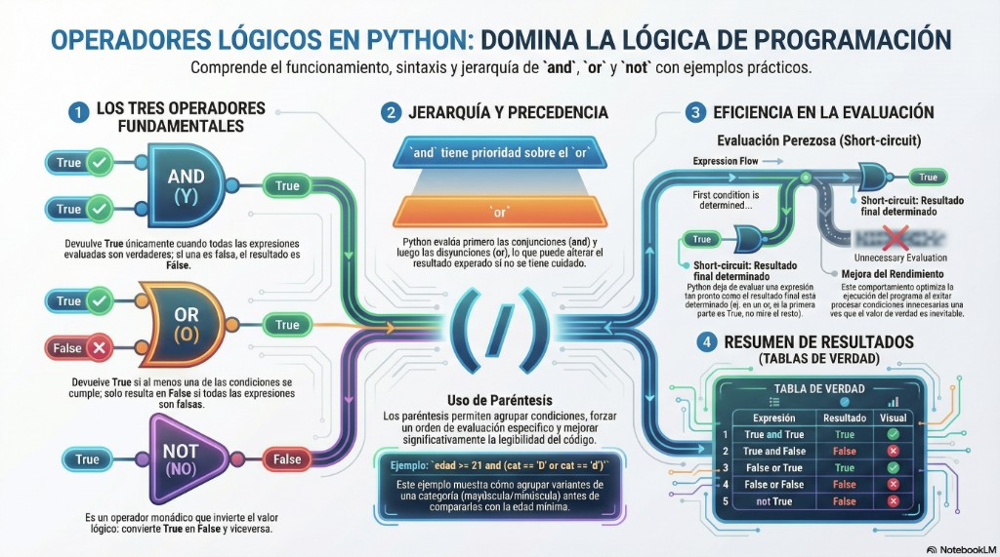

# Unidad 2 - Operadores Lógicos en Python

**Materia:** Programación 1
**Unidad:** 2 - Estructuras Condicionales
**Tema:** Operadores lógicos (`and`, `or`, `not`)

---

## Introducción

En programación, muchas veces necesitamos evaluar **más de una condición** dentro de una misma estructura condicional. Para esto utilizamos los **operadores lógicos**, que permiten combinar múltiples condiciones en una sola expresión lógica.

Estos operadores:

- **Toman como entrada** valores booleanos (`True` o `False`).
- **Devuelven como resultado** otro valor booleano.



---

## 1. Los tres operadores fundamentales

### 1.1. Operador `and` (Y)

Devuelve `True` **solo cuando todas las expresiones** involucradas son verdaderas. Si al menos una de las condiciones es falsa, el resultado final será `False`.

> Se usa cuando es necesario que **todas** las condiciones se cumplan al mismo tiempo.

**Tabla de verdad:**

| A | B | A `and` B |
|---|---|-----------|
| `True` | `True` | **`True`** |
| `True` | `False` | `False` |
| `False` | `True` | `False` |
| `False` | `False` | `False` |

**Ejemplos:**

```python
edad = 25
registrado = True

print(edad > 18 and registrado)   # True
print(edad > 30 and registrado)   # False (la primera condición falla)
```

---

### 1.2. Operador `or` (O)

Devuelve `True` cuando **al menos una** de las expresiones es verdadera. Solo devuelve `False` si **todas** las condiciones son falsas.

> Se usa cuando alcanza con que **una sola** condición sea verdadera.

**Tabla de verdad:**

| A | B | A `or` B |
|---|---|----------|
| `True` | `True` | `True` |
| `True` | `False` | `True` |
| `False` | `True` | `True` |
| `False` | `False` | **`False`** |

**Ejemplos:**

```python
usuario_es_admin = False
tiene_permisos = True

print(usuario_es_admin or tiene_permisos)   # True (alcanza con uno)
print(False or False)                       # False
```

---

### 1.3. Operador `not` (NO)

Es un operador **monádico** (recibe un solo operando) que **invierte** el valor lógico de una expresión booleana.

- Si la expresión original es `True`, el resultado será `False`.
- Si la expresión original es `False`, el resultado será `True`.

**Tabla de verdad:**

| A | `not` A |
|---|---------|
| `True` | `False` |
| `False` | `True` |

**Ejemplos:**

```python
es_suscriptor = False

print(not es_suscriptor)    # True
print(not (5 > 3))          # False  (5 > 3 es True, not True es False)
```

---

## 2. Tabla resumen

| Operador | Descripción | Ejemplo |
|----------|-------------|---------|
| **`and` (Y)** | Devuelve `True` si **ambas** condiciones son verdaderas | `edad > 18 and registrado` |
| **`or` (O)** | Devuelve `True` si **al menos una** de las condiciones es verdadera | `usuario_es_admin or tiene_permisos` |
| **`not` (NO)** | **Invierte** el valor de una condición (`True` ↔ `False`) | `not es_suscriptor` |

---

## 3. Combinación de expresiones booleanas

Los operadores lógicos se utilizan para combinar expresiones booleanas, que pueden ser:

- **Valores directos** (`True`, `False`, variables booleanas).
- **Resultados de comparaciones relacionales** (`==`, `!=`, `<`, `>`, `<=`, `>=`).

### Ejemplo: validar acceso de un usuario

Queremos determinar si un usuario puede acceder a un sistema. Debe cumplir:

- Tener más de 18 años.
- Estar registrado.

**Sin operadores lógicos** (anidando condicionales):

```python
edad = 25
registrado = True

if edad > 18:
    if registrado:
        print("Acceso permitido")
    else:
        print("Acceso denegado")
else:
    print("Acceso denegado")
```

**Con operadores lógicos** (más sencillo y legible):

```python
edad = 25
registrado = True

if edad > 18 and registrado:
    print("Acceso permitido")
else:
    print("Acceso denegado")
```

---

## 4. Uso combinado de operadores lógicos

Los operadores lógicos pueden combinarse entre sí y también con operadores relacionales, permitiendo construir expresiones más complejas.

### Jerarquía y precedencia

En Python, el orden de evaluación de los operadores lógicos es:

1. **`not`** (mayor prioridad)
2. **`and`**
3. **`or`** (menor prioridad)

> Es decir: `and` tiene prioridad sobre `or`. Python evalúa primero las conjunciones (`and`) y luego las disyunciones (`or`), lo que puede alterar el resultado esperado si no se tiene cuidado.

### Uso de paréntesis

Los **paréntesis** permiten:

- **Forzar un orden de evaluación específico** distinto al de la jerarquía por defecto.
- **Mejorar la legibilidad** del código.
- **Agrupar condiciones** lógicamente relacionadas.

**Ejemplo:**

```python
edad = 22
cat = "D"

if edad >= 21 and (cat == "D" or cat == "d"):
    print("Habilitado para conducir camiones")
```

Sin los paréntesis, la expresión `edad >= 21 and cat == "D" or cat == "d"` se interpretaría como `(edad >= 21 and cat == "D") or cat == "d"`, lo que cambiaría el significado.

### Ejemplos comparativos

```python
# Sin paréntesis (and tiene prioridad sobre or):
print(True or False and False)     # True   → True or (False and False) → True or False
print((True or False) and False)   # False  → forzamos el or primero

# Combinando relacionales y lógicos:
edad = 30
ingreso = 50000
print(edad > 18 and ingreso > 25000)        # True
print(edad < 18 or ingreso > 100000)        # False
print(not (edad < 18))                       # True
```

---

## 5. Evaluación perezosa (short-circuit evaluation)

Las expresiones lógicas en Python se evalúan utilizando **evaluación perezosa** (también llamada **cortocircuito** o **short-circuit**), lo que significa que **Python deja de evaluar una expresión tan pronto como el resultado ya puede determinarse**.

### Cómo funciona

| Operador | Cuando ya se sabe el resultado | Python deja de evaluar |
|----------|-------------------------------|------------------------|
| **`or`** | Si la primera condición es **`True`** | el resto (el resultado ya es `True`) |
| **`and`** | Si la primera condición es **`False`** | el resto (el resultado ya es `False`) |

### Ejemplos

```python
# Con or: si la primera es True, no se evalúa la segunda
print(True or alguna_funcion_lenta())   # No ejecuta alguna_funcion_lenta()

# Con and: si la primera es False, no se evalúa la segunda
print(False and alguna_funcion_lenta())  # No ejecuta alguna_funcion_lenta()
```

### Caso práctico: evitar errores de división por cero

```python
divisor = 0
numero = 10

# Si divisor es 0, no se evalúa la división, evitando ZeroDivisionError
if divisor != 0 and (numero / divisor) > 1:
    print("La división es mayor a 1")
else:
    print("Divisor es cero o resultado <= 1")
```

### Ventajas

1. **Mejora el rendimiento**: evita ejecutar condiciones innecesarias.
2. **Permite escribir código más seguro**: se pueden encadenar comprobaciones que dependen unas de otras.
3. **Optimiza la ejecución**: Python optimiza el programa al salir tan pronto como el valor de verdad es inevitable.

---

## 6. Errores comunes y buenas prácticas

### ❌ No usar `=` en lugar de `==`

```python
# MAL: = es asignación, == es comparación
if x = 5 and y > 0:    # SyntaxError
    ...

# BIEN
if x == 5 and y > 0:
    ...
```

### ❌ No olvidar los paréntesis cuando hace falta

```python
# Posible error de lógica:
if edad >= 18 or edad >= 16 and tiene_permiso:
    # Por la precedencia, equivale a: edad >= 18 or (edad >= 16 and tiene_permiso)
    ...

# Más claro:
if edad >= 18 or (edad >= 16 and tiene_permiso):
    ...
```

### ✅ Aprovechar la evaluación perezosa para validaciones seguras

```python
# Verificar que la lista no esté vacía antes de acceder a un elemento:
if lista and lista[0] > 0:
    ...

# Verificar que un string no sea None antes de usar métodos:
if texto and texto.startswith("Hola"):
    ...
```

### ✅ Usar nombres descriptivos para variables booleanas

```python
# MAL
if a and b and not c:
    ...

# BIEN
if es_mayor_de_edad and tiene_dni and not esta_inhabilitado:
    ...
```

---

## 7. Conclusión

Los operadores lógicos (`and`, `or`, `not`) son herramientas fundamentales para construir **expresiones condicionales complejas** en Python. Junto con los operadores relacionales, permiten modelar reglas de negocio y tomar decisiones en los programas.

**Puntos clave a recordar:**

1. **`and`** → todas verdaderas; **`or`** → al menos una verdadera; **`not`** → invierte.
2. La **precedencia** es: `not` > `and` > `or`. Usar **paréntesis** para forzar el orden y mejorar la legibilidad.
3. Python usa **evaluación perezosa**: deja de evaluar tan pronto como el resultado ya puede determinarse.
4. Las expresiones lógicas siempre devuelven un valor **booleano** (`True` o `False`).

---

*Apuntes - Unidad 2 - Programación 1 - Tecnicatura UTN 2026*
